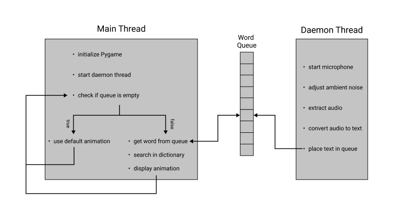

# Real Time Sign Language Translator

A Python script that uses single producer single consumer queue to process speech to sign language animations. The following diagram describes the functioning of the program:




### Running

```sh
python3 proto-thread.py
```
